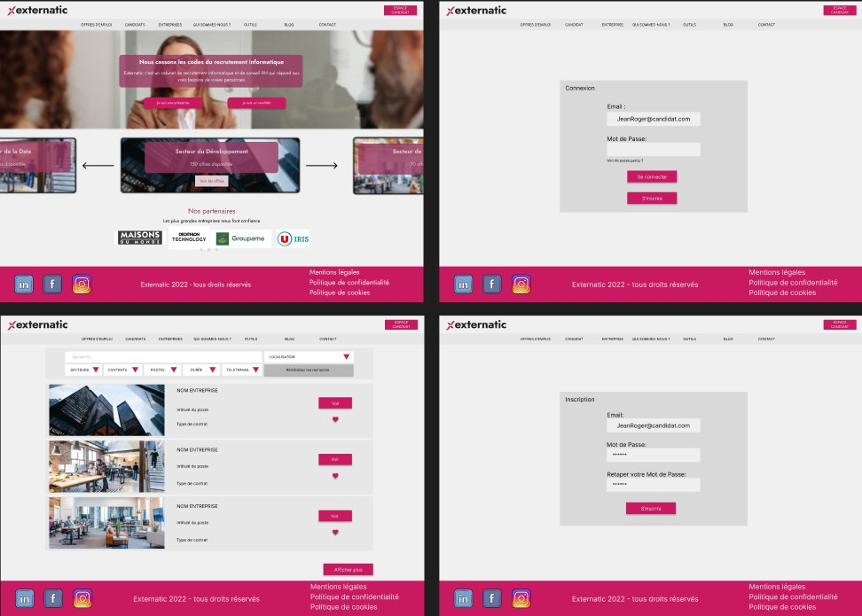
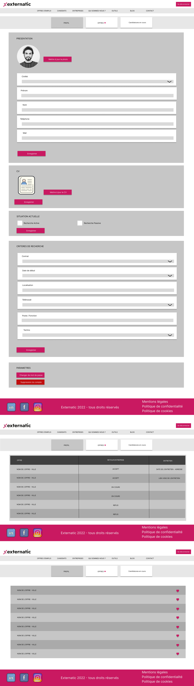
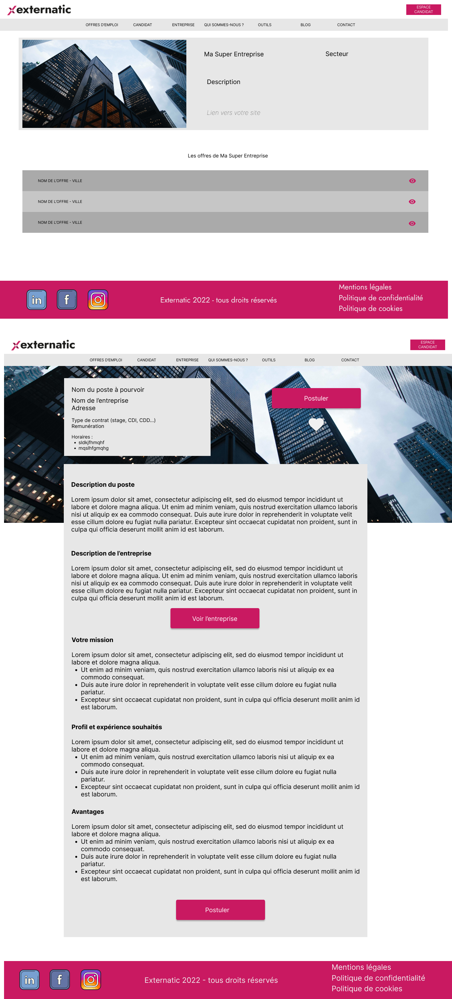
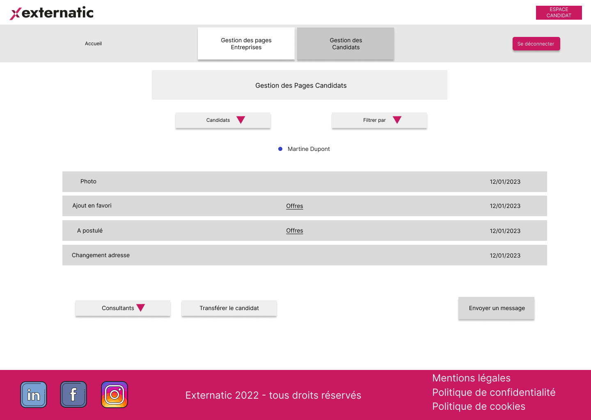
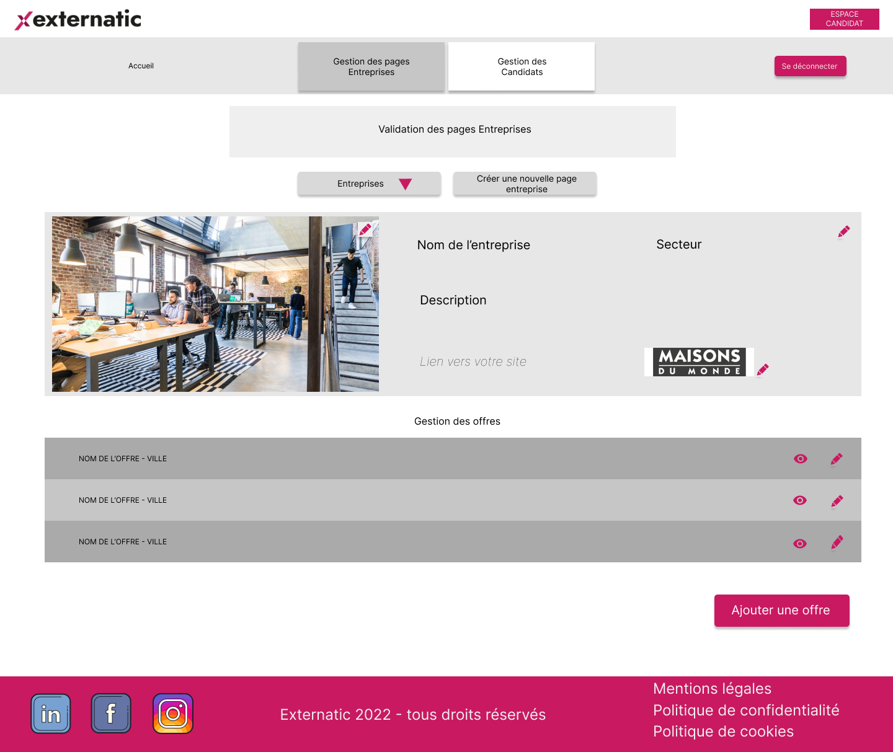
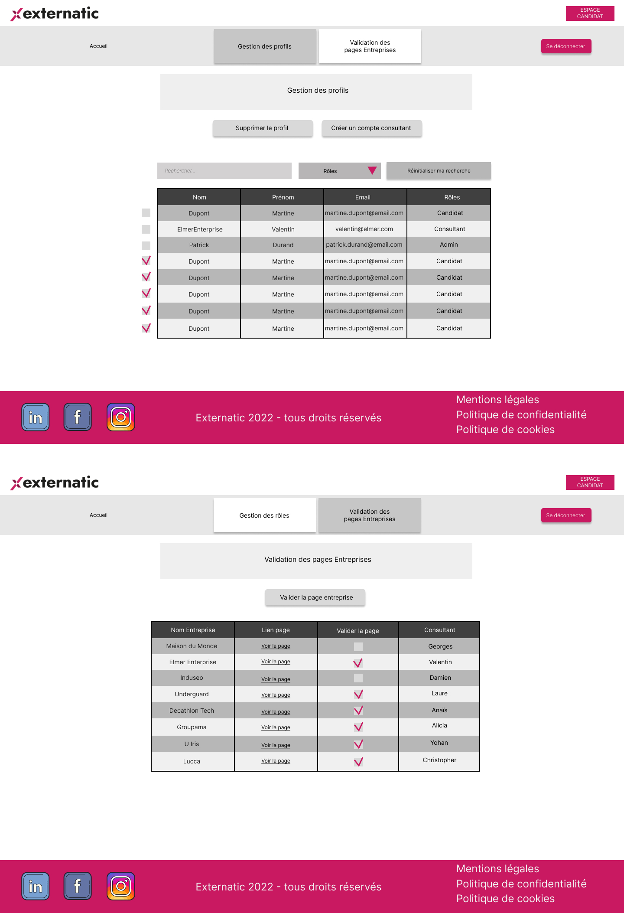
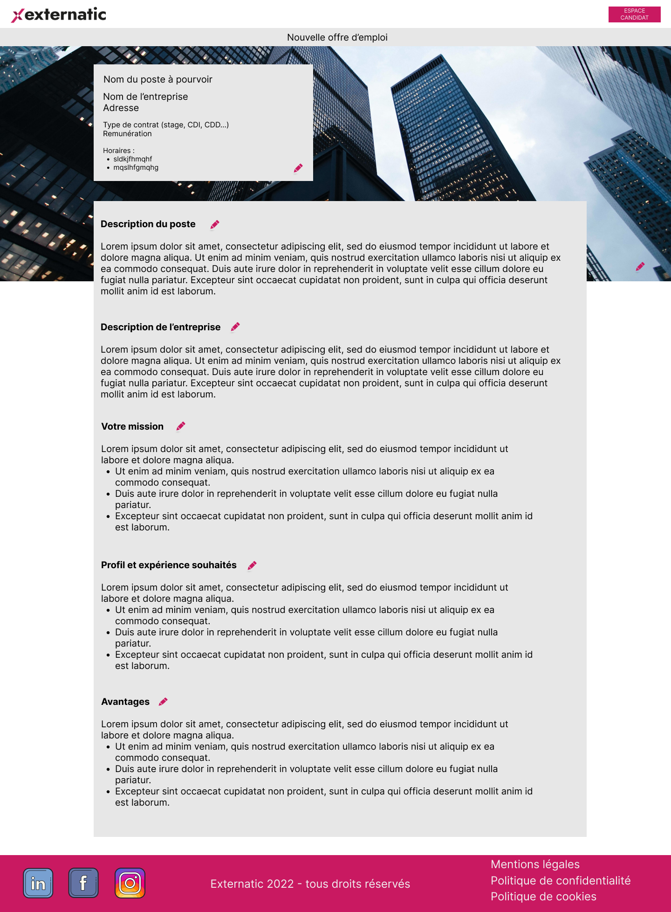
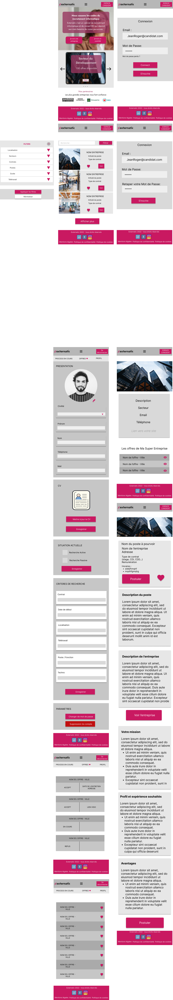

Welcome to the Externatic job search platform project, in partnership with the Wild Code School.

## Concept

Externatic is a recruitment firm specializing in IT, industry, and cybersecurity. In order to manage the job offers from their partner companies and the profiles of their candidates, Externatic needed a management tool in addition to their website. For this purpose, they partnered with the Wild Code School.

For the web developers at the Wild Code School, this project marks the end of the 5-month training course they have followed.

The project definition included the implementation of a proof of concept (POC). The students presented the POC on Thursday, February 9, 2023 in the presence of representatives from Externatic and instructors from the Wild Code School.

## Durée

To carry out this POC, the students at the Wild Code School had 10 weeks.

## Technos

The site was developed using the following technologies :
- React
- Node
- Express

## Team

Our developer team was made up of the following individuals :
- Christopher Raspail
- Amélie Dupil
- Yohan Rosano
- Valentin Dupin
- Laure Janin (PO)

## Wireframes

## Template

This template is meant to serve as a foundation for every project 2 and project 3 following the React-Express-MySQL stack, as learned in Wild Code School.
It's pre-configured with a set of tools which'll help students produce industry-quality and easier-to-maintain code, while staying as simple as possible to use.

### Setup & Use

#### Project Initialization

- In VSCode, install plugins **Prettier - Code formatter** and **ESLint** and configure them
- Clone this repo, enter it
- Run command `npm run setup`
- _NB: To launch the backend server, you'll need an environment file with database credentials. You'll find a template one in `backend/.env.sample`_

#### Available Commands

- `setup` : Initialization of frontend and backend, as well as all toolings
- `migrate` : Run the database migration script
- `dev` : Starts both servers (frontend + backend) in one terminal
- `dev-front` : Starts the React frontend server
- `dev-back` : Starts the Express backend server
- `lint` : Runs validation tools, and refuses unclean code (will be executed on every _commit_)
- `fix` : Fixes linter errors (run it if `lint` growls on your code !)

## FAQ

### Tools

- _Concurrently_ : Allows for several commands to run concurrently in the same CLI
- _Husky_ : Allows to execute specific commands that trigger on _git_ events
- _Vite_ : Alternative to _Create-React-App_, packaging less tools for a more fluid experience
- _ESLint_ : "Quality of code" tool, ensures chosen rules will be enforced
- _Prettier_ : "Quality of code" tool as well, focuses on the styleguide
- _ Airbnb Standard_ : One of the most known "standards", even though it's not officially linked to ES/JS
- _Nodemon_ : Allows to restart the server everytime a .js file is udated
